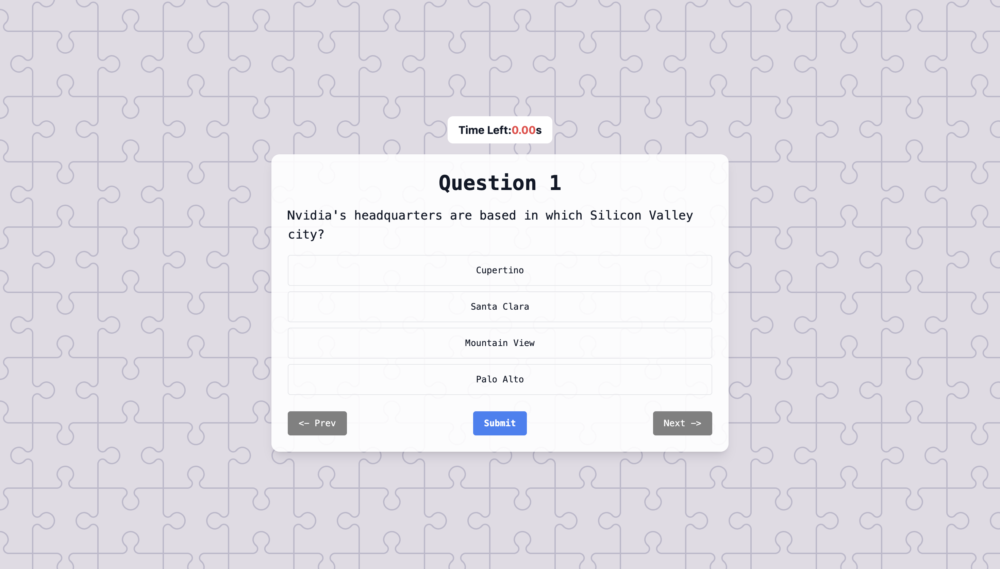
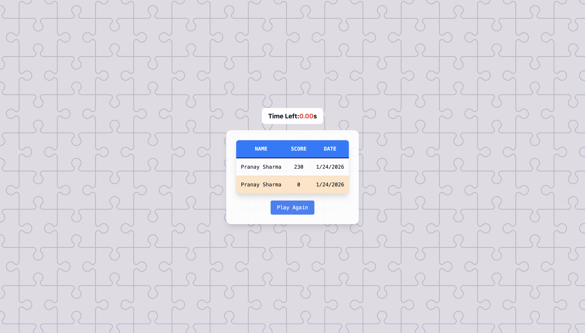

# 🎯 Quiz Game

A fully interactive **Quiz Game** built using **Vanilla JavaScript** and **Tailwind CSS**.  
This project focuses on real-world JavaScript logic like timers, async API handling, state management, and leaderboard persistence.

🔗 **Live Demo:** https://quiz-game-delta-lac.vercel.app  
💻 **GitHub Repository:** https://github.com/Pranay-opsraga/Quiz-Game

---

## 📸 Preview





---

## 🚀 Features

- ⏱ **Real-time countdown timer**
  - Accurate time tracking
  - Pause-safe (prevents multiple timers)
- ❓ **Dynamic quiz questions**
  - Fetched from an external trivia API
- 🔄 **Next / Previous navigation**
  - User answers persist while navigating
- ✅ **Instant answer validation**
  - Correct & wrong answers highlighted
- 🧮 **Scoring System**
  - +100 points per correct answer
  - ⏳ Remaining time added as bonus
- 🏆 **High Score Leaderboard**
  - Stores name, score, and date
  - Sorted automatically (Top 10)
  - Highlights the latest score
- ⏳ **Loading screen on submission**
- 🛡 **Edge case handling**
  - Empty name defaults to *Anonymous*
  - API failures handled gracefully

---

## 🛠 Tech Stack

- HTML5
- Vanilla JavaScript
- Tailwind CSS
- REST APIs
- Async / Await
- Vercel (Deployment)

---

## 🧠 What I Learned

- Managing complex timer logic without frameworks
- Preventing interval duplication bugs
- Handling async API calls and error states
- Maintaining application state across navigation
- Sorting and persisting leaderboard data
- Deploying production-ready projects on Vercel

This project looked simple initially, but implementing all edge cases made it a great learning experience.

---

## 📦 How to Run Locally

```bash
git clone https://github.com/Pranay-opsraga/Quiz-Game.git
cd Quiz-Game
```

Then simply open `index.html` in your browser.

---

## 🌍 Deployment

This project is deployed using **Vercel**.

- Automatic deployments on every push to the `main` branch
- Global CDN for fast load times
- Zero configuration required for static hosting

🔗 **Live URL:** https://quiz-game-delta-lac.vercel.app

---

## 📂 Project Structure

```
Quiz-Game/
│
├── index.html
├── style.css
├── script.js
├── assets/
│   ├── preview.png
│   └── leaderboard.png
└── README.md
```

---

## 🔮 Future Improvements

- Difficulty levels (Easy / Medium / Hard)
- Restart quiz functionality
- Dark mode
- Question progress bar
- User authentication for leaderboard

---

## 🙌 Acknowledgements

- Quiz questions powered by **Open Trivia DB**
- UI styled with **Tailwind CSS**
- Deployed using **Vercel**

---

## ⭐ Support

If you liked this project, consider giving the repo a ⭐  
It really helps and motivates me to build more projects!

---

### 👤 Author

**Pranay Sharma**  
Aspiring Software Engineer | Learning by building 🚀
